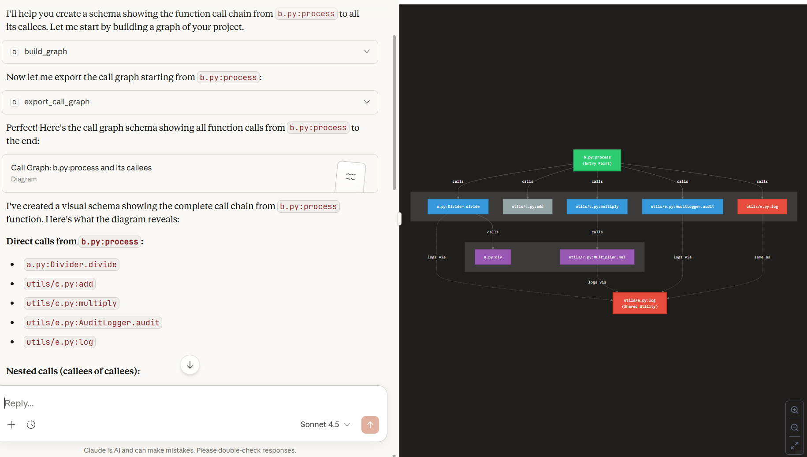
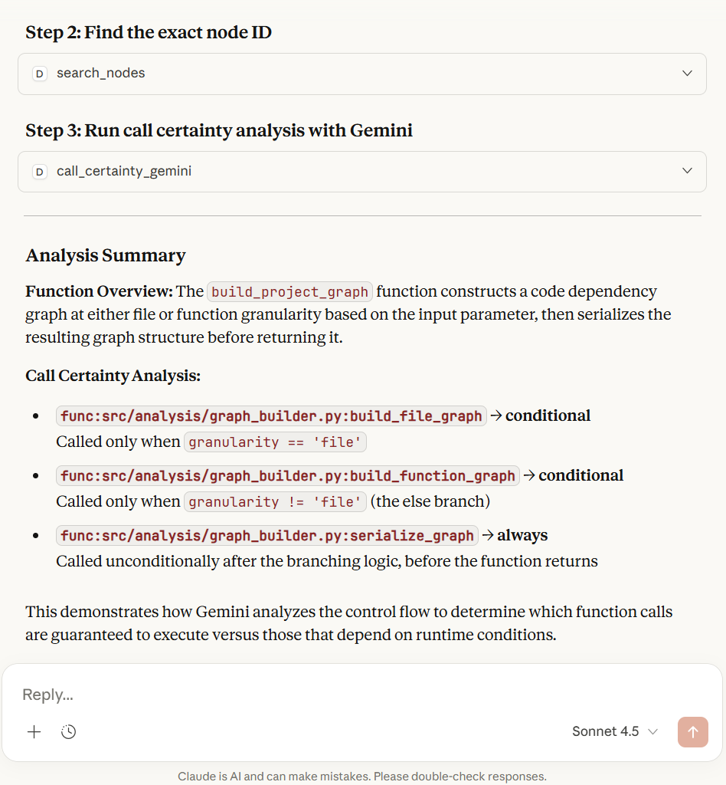

# Debug Graph MCP (Python Call Graph + Gemini “Call Certainty”)

A lightweight **MCP server** that builds a **Python call graph** for a project and lets you query, visualize, and summarize architecture — directly from **Claude Desktop** via tools.


It supports:
- Building a project graph (function-level)
- Querying callers/callees/dependencies/paths
- Exporting a Mermaid / DOT call graph snippet
- Optional **Gemini-powered “call certainty”** classification: for a given function, Gemini decides which callees are **always vs conditional** based on the function’s source code + the graph-extracted callees list.

---

## ✨ What you can do with it

### 1) Explore architecture
- “Who calls this function?”
- “What does this function call?”
- “Show me a call chain from A → B”
- “Give me a focused call graph around this function”

### 2) Visualize call graphs (Mermaid/DOT)
- Export subgraphs with focus + direction + depth.

### 3) AI add-on: Call Certainty (Gemini)
For a specific function:
- Extract its source code
- Extract the callees list from the call graph
- Ask Gemini to classify each callee:
  - `always` (definitely called)
  - `conditional` (called only in certain branches)
  - `unlikely` / `unknown` (optional categories, depending on prompt/schema)

---

## ✅ Requirements

- Python 3.10+ (recommended)
- Claude Desktop (to run MCP tools)
- (Optional) Gemini API key for the AI tool

---

## 🚀 Quickstart

### 1) Create and activate a virtual environment
```bash
python -m venv .venv
# Windows (PowerShell)
.venv\Scripts\Activate.ps1
# macOS/Linux
source .venv/bin/activate
```

### 2) Install dependencies
```bash
pip install -r requirements.txt
```

### 3) (Optional) Set Gemini API key
Create a `.env` file in the project root:
```env
GEMINI_API_KEY=your_key_here
```


### 4) Run the MCP server
```bash
python server.py
```

---

## 🔌 Connect Claude Desktop to the MCP server

In Claude Desktop, add an MCP server entry (example structure depends on your Claude config).
You generally point Claude to run:

- **Command:** your venv Python executable  
- **Args:** `server.py`

Example (conceptual):
```json
{
  "mcpServers": {
    "debug_graph_mcp": {
      "command": "C:/path/to/project/.venv/Scripts/python.exe",
      "args": ["C:/path/to/project/server.py"]
    }
  }
}
```

Restart Claude Desktop, open a chat, and verify the tools appear.

---

## 🧰 Tools (what Claude can call)

These tools are registered in `src/mcp/tools_graph.py`:

### Graph Tools
- `build_graph(root_path, granularity="function", resolve_calls="jedi" | "fallback_only", ...)`
- `graph_overview(graph_id)`
- `search_nodes(graph_id, query)`
- `query_graph(graph_id, query_type, target, path_target?)`
- `export_call_graph(graph_id, focus?, depth, direction, format="mermaid"|"dot")`
- `list_cached_graphs()`
- `clear_graph_cache(graph_id?)`

### AI Tool (Gemini)
- `call_certainty_gemini(graph_id, target, model, api_key?, ...)`

This one sends:
- Function source code
- Graph-derived callees list  
…and returns structured JSON classification from Gemini.

---

## 🧪 Typical Workflow (recommended)

### Step 1 — Build the graph
Use a clean path format (avoid hidden control chars like TAB).
```text
build_graph(
  root_path="C:/Users/.../test_project",
  granularity="function",
  resolve_calls="jedi"
)
```

### Step 2 — Find the exact node id
```text
search_nodes(graph_id="...", query="b.py:process")
```

You’ll get something like:
- `func:b.py:process`

### Step 3 — Ask “who does it call?”
```text
query_graph(
  graph_id="...",
  query_type="callees",
  target="func:b.py:process"
)
```

### Step 4 — Export a diagram (Mermaid)
```text
export_call_graph(
  graph_id="...",
  focus="func:b.py:process",
  depth=3,
  direction="out",
  format="mermaid"
)
```

### Step 5 — (Optional) Call Certainty with Gemini
```text
call_certainty_gemini(
  graph_id="...",
  target="func:b.py:process"
)
```

---

## ⚡ Performance: “Jedi” vs “Fast fallback”

### `resolve_calls="jedi"` (default)
- More accurate cross-file resolution
- Slower on large repos

### `resolve_calls="fallback_only"` (fast mode)
- Much faster
- Less accurate in dynamic code patterns
- Still useful for:
  - high-level exploration
  - hotspots
  - quick call graph sketches

Recommended: Use **fallback_only** for huge repos, and switch to **jedi** when you need correctness on a specific area.

---

## 🗂️ Project Structure (high-level)

```text
.
├─ server.py                  # Entry point (creates FastMCP + registers tools)
├─ src/
│  ├─ mcp/
│  │  ├─ tools_graph.py          # Tool layer: thin wrappers calling GraphService
│  │  ├─ graph_service.py        # Service layer: orchestration + cache usage
│  │  ├─ graph_inputs.py         # Input normalization helpers
│  ├─ analysis/
│  │  ├─ graph_builder.py        # Builds graph from Python source (AST/Jedi/fallback)
│  │  ├─ graph_cache.py          # GraphCache (signature + LRU)
│  │  ├─ graph_queries.py        # callers/callees/deps/path logic
│  │  ├─ node_resolver.py        # resolves "b.py:process" → "func:b.py:process"
│  │  ├─ graph_viz.py            # Mermaid/DOT export with focus+depth
│  │  ├─ graph_stats.py          # graph_overview stats (entrypoints/leaves/hotspots)
│  │  ├─ call_certainty_gemini.py# Gemini prompt + request/parse (AI feature)
└─ docs/
   └─ image.png                    #  screenshots 
```


---

## 🖼️ Screenshots

### Example: Asking Claude for a Call Graph (b.py:process)

This screenshot shows a real end-to-end flow in Claude Desktop using this MCP server:

1. Claude calls `build_graph` to analyze the project and build a function-level call graph.
2. Claude calls `export_call_graph` with `focus="func:b.py:process"` (plus `depth` / `direction`) to export a focused Mermaid subgraph.
3. Claude renders/summarizes the result: direct callees and deeper nested calls.



**What this demonstrates**
- Natural language → tool calls → structured graph output
- A focused call graph around a specific function (not the entire repo)
- A visual, shareable diagram that’s easier to reason about than raw code navigation


### Example: Gemini “Call Certainty” (`call_certainty_gemini`)

This screenshot demonstrates the AI add-on: the tool sends **the target function source code** + **the graph-extracted callees list** to Gemini, and Gemini classifies each callee as `always` or `conditional`.

**What this demonstrates**
- Combines static graph extraction with LLM reasoning
- Classifies callees as always vs conditional (best-effort, no runtime tracing)
- Produces structured JSON that’s easy to read and screenshot in a report


```python
def build_project_graph(
    root: str,
    granularity: str = "function",
    include_external: bool = False,
    resolve_calls: str = "jedi",  # "jedi" | "fallback_only"
) -> dict:
    if granularity == "file":
        g = build_file_graph(root, include_external)
    else:
        g = build_function_graph(root, include_external, resolve_calls=resolve_calls)
    return serialize_graph(g)
```

> Screenshot: Gemini Call Certainty result



---

## 🧯 Troubleshooting

### “Path contains control characters (e.g. TAB)”
Use forward slashes in Inspector:
- ✅ `C:/Users/.../test_project`
- ❌ paths that accidentally include a TAB or weird copy/paste characters

### “Unknown graph_id”
Run `build_graph` first and use the returned `graph_id`.

### “Unknown target node id”
Use `search_nodes` first and copy the returned id exactly:
- `func:...`
- `class:...`
- `file:...`

### Gemini errors: missing key
Ensure `.env` exists with:
```env
GEMINI_API_KEY=...
```
(or pass `api_key` directly to the tool).

---

## 📌 Notes / Limitations
- Call graphs are an approximation: Python’s dynamic features can hide or alter call relationships.
- `fallback_only` mode favors speed over perfect resolution.
- AI outputs can vary; treat Gemini classifications as “best effort” analysis, not a compiler guarantee.

---


